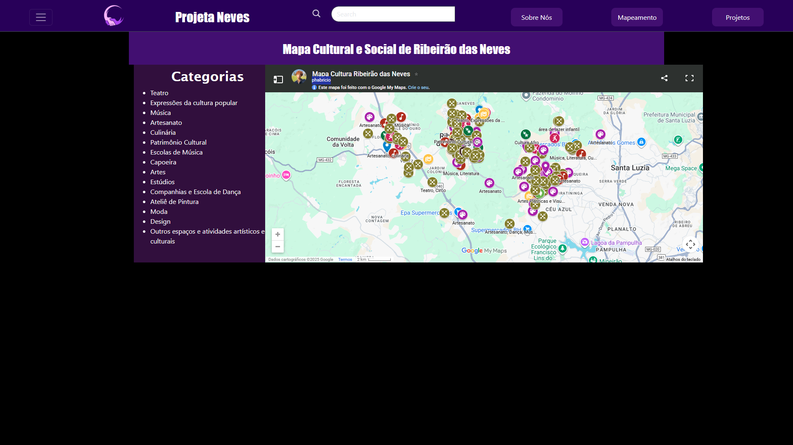

# Mapeamento Social e Cultural de Ribeirão das Neves

## Nosso projeto
Projeta neves é um projeto de mapeamento cultural de Ribeirão das Neves visa valorizar espaços de arte, cultura e lazer através de uma cartografia participativa. Estudantes do IFMG criarão um site interativo, destacando aspectos positivos da cidade e desconstruindo estereótipos negativos. A iniciativa integra tecnologia e geografia, promovendo a conexão entre a comunidade escolar e o território.

## Link do Site

[Projeta Neves](https://gustavofteo.github.io/MapeamentoSocialECulturalDeRibeiraoDasNeves/)

## Mídias

## Funcionalidades 
* Listar projetos  
* Selecionar projeto no mapa  
* Pesquisar projeto
* Login
* Botão gostaria de ir
* Sistema de curtida
* Sistema de salvar projeto
* Compartilhamento

## Autores
[Gustavo Ferreira Teodoro](https://gustavofteo.github.com).  
[Phabricio Raphael Pereira da Silva](https://github.com/pharafa).  
[Sarah Rayane Correia do Nascimento](https://github.com/SarahRayane11).  
[Laís Cristina](https://gustavofteo.github.io/MapeamentoSocialECulturalDeRibeiraoDasNeves/).  
[Carla Jhenifer Morais Vieira](https://gustavofteo.github.io/MapeamentoSocialECulturalDeRibeiraoDasNeves/).  
[Emily](https://gustavofteo.github.io/MapeamentoSocialECulturalDeRibeiraoDasNeves/).  
[Lucas](https://gustavofteo.github.io/MapeamentoSocialECulturalDeRibeiraoDasNeves/).  

## Fluxo de navegação

[Fruxo de Navegacao](https://gustavofteo.github.io/MapeamentoSocialECulturalDeRibeiraoDasNeves/)
